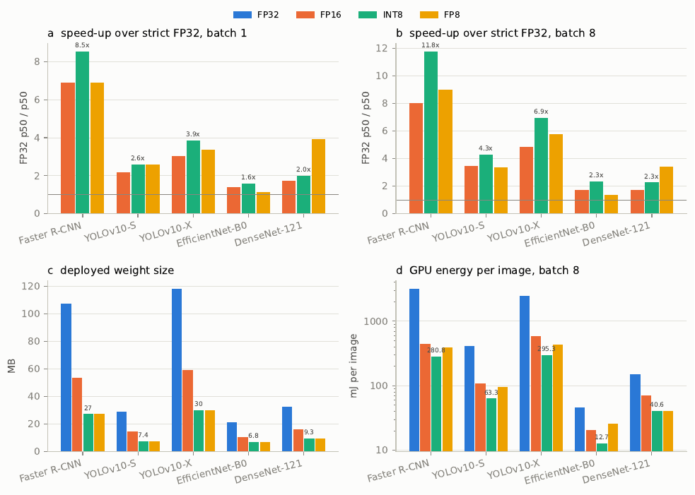
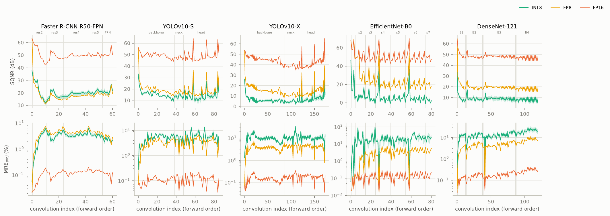
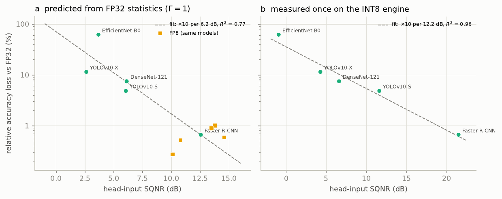
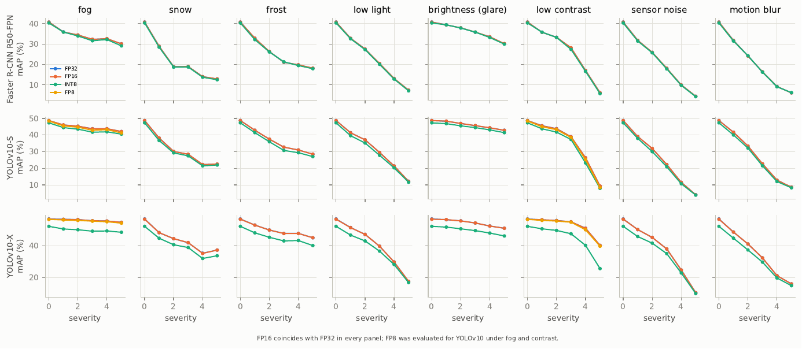
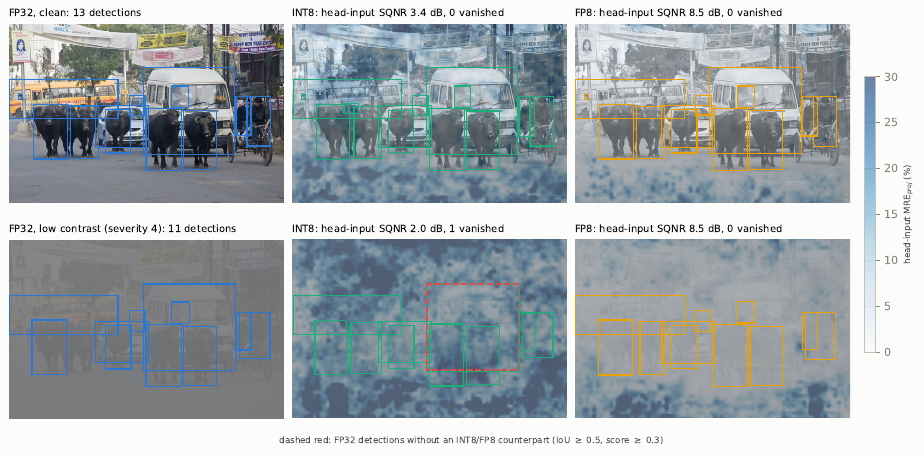

# EchteAI — PEP-AI validation of quantized perception models

> T. Menyhárt, A. Hajdu, R. Lakatos: *PEP-AI Validated Quantization for Energy-Efficient Perception in
> Intelligent Transportation Systems*. Journal manuscript (in preparation).

**Manuscript (PDF): [`paper/PEP-AI_manuscript.pdf`](paper/PEP-AI_manuscript.pdf)** · **Supplementary Information (proofs,
extended tables and figures): [`paper/PEP-AI_supplementary.pdf`](paper/PEP-AI_supplementary.pdf)** · LaTeX source:
[`paper/`](paper/) (Springer Nature template; one source, compiles as is on Overleaf or with `latexmk -pdf main.tex`;
`paper/split_pdf.sh` splits the compiled PDF into the article and the Supplementary Information).

PEP-AI (*Precise, Explainable and Provable AI*) validates post-training quantized networks at the activation
level instead of on output accuracy alone. The repository contains the article, a static analysis tool that
tells from the FP32 parameters alone how much noise INT8, FP8 and FP16 inject into any PyTorch model, and the
complete pipeline that produced every number of the article (journal extension of the CITDS 2026 paper,
whose code is kept under the tag [`citds-2026`](https://github.com/EgyipTomi425/EchteAI/tree/citds-2026)).

## Key findings and what to watch for

1. **The error has two parts.** The noise each quantizer injects is predictable from FP32 statistics. How the
   network propagates it to the task head (the factor Γ̄, from 0.13 attenuating to 2.89 amplifying) needs one
   measurement on unlabelled images. The propagation, not the size of the network, decides the INT8 loss:
   Faster R-CNN (26.8 M parameters) lost 0.25 mAP, EfficientNet-B0 (5.3 M) lost 41 top-1 points.
2. **FP8 noise does not depend on the data, INT8 noise does.** FP8 E4M3 injects about 31.5 dB (2.7 %) per quantizer
   whatever the activations look like, so the static analysis predicts it within 0.02–0.14 dB without images. INT8
   noise depends on the range and the tails, and the static estimate is 4–6 dB too optimistic for SiLU and ReLU outputs.
3. **Noise is not accuracy.** A 25 % deviation of the head-input features cost ResNet-50 only 2.8 % of its top-1
   accuracy. Accuracy needs either labels or the measured head-input SQNR (loss ×10 per 12 dB, within about ×2).
4. **INT8 is fragile in ways that aggregate accuracy hides:**
   * the result depends on the order of the calibration images (EfficientNet-B0: 24.8 % or 41.7 %);
   * low contrast costs INT8 up to 36 % but FP8 at most 1.9 %, because the scales are fixed at calibration;
   * a NMS-free detector loses its duplicate suppression (YOLOv10-X: 15.2 % duplicate boxes).
5. **Quantize weights per channel.** Per-tensor INT8 weight scales add 4–8.5 dB of noise; for FP8 it does not matter.
6. **Repair is local.** Where the damage sits in a few layers, keeping them in FP16 restores the accuracy
   (EfficientNet-B0 24.8 % → 66.0 %, DenseNet-121 57.4 % → 61.6 %); where it is spread out (YOLOv10-S), only FP8 or
   another range setting helps.
7. **Judge single detections locally.** The deviation inside a box predicts whether that detection vanishes (odds
   ratio 1.7–4.2 per doubling); the image-level deviation does not.
8. **What to use:** INT8 for networks that attenuate the noise (check with one measurement), FP8 for the others where
   the hardware supports it (Hopper/Ada/Blackwell, not e.g. DRIVE Orin), FP16 as the lossless fallback.

## Results in brief

Measured on an NVIDIA H200 with TensorRT 11.3 (COCO val2017 box mAP, ImageNetV2 top-1; Table 5 of the article):

| Network | Metric | FP32 | FP16 | INT8 | FP8 |
|---|---|---|---|---|---|
| Faster R-CNN R50-FPN | COCO mAP | 37.0 | 36.9 | **36.7** (−0.25) | 36.6 (−0.37) |
| | latency bs1 (ms) | 6.29 | 0.91 | 0.74 | 0.91 |
| | energy bs8 (mJ/img) | 3184 | 443 | 281 | 392 |
| YOLOv10-S | COCO mAP | 46.0 | 46.0 | **43.8** (−2.24) | 45.6 (−0.41) |
| | latency bs1 (ms) | 1.78 | 0.81 | 0.69 | 0.68 |
| | energy bs8 (mJ/img) | 409 | 109 | 63.3 | 96.7 |
| YOLOv10-X | COCO mAP | 54.0 | 54.0 | **47.8** (−6.21) | 53.9 (−0.15) |
| | latency bs1 (ms) | 6.06 | 1.99 | 1.57 | 1.79 |
| | energy bs8 (mJ/img) | 2477 | 582 | 295 | 430 |
| EfficientNet-B0 | top-1 (%) | 65.8 | 65.8 | **24.8** (−40.97) | 65.4 (−0.39) |
| | latency bs1 (ms) | 0.59 | 0.42 | 0.38 | 0.52 |
| | energy bs8 (mJ/img) | 45.7 | 20.6 | 12.7 | 26.0 |
| DenseNet-121 | top-1 (%) | 62.0 | 62.0 | **57.4** (−4.68) | 61.7 (−0.32) |
| | latency bs1 (ms) | 2.78 | 1.59 | 1.39 | 0.71 |
| | energy bs8 (mJ/img) | 152 | 70.5 | 40.6 | 40.9 |



*COCO mAP* is the official detection metric: precision averaged over 80 classes and ten box-overlap thresholds
from IoU 0.50 to a near pixel-exact 0.95, so values of 37–54 are the published state of the art for these models
(Faster R-CNN 37.0, YOLOv10-X 54.4); at IoU 0.5 the detectors find 82–86 % of persons and 88–93 % of large road
users. *Top-1* is on ImageNetV2, a deliberately harder re-collected test set (65.8 % here corresponds to 77.7 % on the
original ImageNet). What matters is the change against FP32 in brackets; strict FP32 runs without TF32, i.e. without
tensor cores, which explains its high latency.

* INT8 is 1.6–11.8× faster than strict FP32 and 1.1–1.5× faster than FP16, and uses 72–91 % less energy per image.
* FP16 is lossless; FP8 loses at most 0.4 points; INT8 loses between 0.25 mAP and 41 top-1 points.
* The difference is explained by the noise model: a single INT8 quantizer is benign (27–33 dB) and predictable,
  whereas the network decides whether it attenuates (Faster R-CNN, Γ̄ = 0.13) or amplifies (EfficientNet-B0,
  Γ̄ = 2.89) the injected noise.
* For a fleet of 1 000 vehicles, INT8 saves up to 1 GWh, 191 kEUR and 251 t CO₂ per year (Section 3.7).

Layer by layer (SQNR against the FP32 engine, higher is better), FP16 stays near the numerical floor, FP8 has a
median layer SQNR of 14–22 dB in every network, and INT8 falls to a network-specific plateau (median 5–20 dB:
about 20 dB for Faster R-CNN, close to 0 dB in parts of EfficientNet-B0):



**How to read dB.** The same image is run through the FP32 and the quantized model, and a layer output is compared:
f is the FP32 tensor, q the quantized one and e = q − f the error. Power means the sum of squares, so

    SQNR = 10 log₁₀( Σ f² / Σ e² ) dB  =  20 log₁₀( ‖f‖ / ‖e‖ ) dB

computed per image and reported as the median over images. The relative error is r = ‖e‖ / ‖f‖ = 10^(−SQNR/20):

| SQNR | 40 dB | 30 dB | 20 dB | 10 dB | 0 dB |
|---|---|---|---|---|---|
| error relative to the signal | 1 % | 3.2 % | 10 % | 32 % | 100 % |

A difference of 6 dB is a factor of two in the error amplitude, 3 dB a factor of two in its power.

## Static analysis of any model (no images, no execution)

`scripts/43_static_analysis.py` reads only the weights and the batch-normalisation buffers of an FP32 PyTorch
model and reports in 20–35 s on a CPU how much noise each number format injects (Section 2.13 of the article):

```bash
pip install torch torchvision pandas pyyaml        # CPU is enough; ultralytics only for YOLOv10
python scripts/43_static_analysis.py --torchvision resnet50       # any torchvision classification model
python scripts/43_static_analysis.py --module my_model.pt         # any model saved with torch.save(model, path)
python scripts/43_static_analysis.py --model all                  # the five networks of the article
```

Example output (ResNet-50, a network not used elsewhere in the article):

```text
=== resnet50: 25.5 M parameters, 54 conv/linear layers (0 depthwise)
  (dB values are SQNR; in brackets the relative error r = 10^(-SQNR/20) in percent of the signal)
  weights      INT8 per channel: median 37.4 dB (1.3 %), worst 25.7 dB (5.2 %)
               INT8 per tensor:  median 26.1 dB (4.9 %), worst 19.7 dB (10.4 %)
               FP8 per channel:  median 31.9 dB (2.6 %), worst 31.6 dB (2.6 %)  (per-tensor FP8 is about the same: the relative error of E4M3 does not depend on the scale)
  activations  53 BN-modelled quantizers; channel spread median 2.6x (max 21x); MSE-optimal kappa median 7.4
               noise injected per quantizer: INT8 median 38.0 dB (1.3 %), worst 30.4 dB (3.0 %); FP8 31.5 dB (2.7 %)
  screening    all activation quantizers together (unit propagation factors, no data): INT8 19.0 dB (11.2 %), FP8 14.3 dB (19.3 %)
  structure    0 sigmoid-type activations (SiLU / gates), 0 attention blocks
  weakest      layer3.1.bn3 (identity): INT8 30.4 dB (3.0 %), spread 4x, kappa 11.9
  weakest      layer1.1.bn3 (identity): INT8 30.8 dB (2.9 %), spread 11x, kappa 12.1
  weakest      layer2.1.bn3 (identity): INT8 32.4 dB (2.4 %), spread 6x, kappa 9.5
  flags        strong channel imbalance (up to 21x) under one per-tensor scale
  coverage     activations taken from the traced graph
  scenarios    activations and weights together, with unit propagation factors: the expected deviation at
               the head input if the network neither attenuates nor amplifies the noise (not the accuracy loss):
                 INT8, per-channel weights      15.8 dB   (16.2 % of the signal)
                 INT8, per-tensor weights        7.4 dB   (42.5 % of the signal)
                 FP8 E4M3                       11.5 dB   (26.7 % of the signal)
                 FP16                           53.4 dB   ( 0.2 % of the signal)
  head input   expected deviation at the head input for the propagation factors measured so far
               (SQNR_h = SQNR_add - 10 log10 Gamma_bar; best case: strongest attenuation, worst case: strongest
               amplification; the network itself is somewhere in between, one measurement tells where):
                 INT8, per-channel weights     5.8 -  42.4 % of the signal (Gamma_bar 0.13-6.86)
                 INT8, per-tensor weights     15.2 - 100.0 % of the signal (Gamma_bar 0.13-6.86)
                 FP8 E4M3                      9.3 -  48.4 % of the signal (Gamma_bar 0.12-3.28)
  references   static INT8 SQNR_add of this network: 19.0 dB. Measured networks of the article (static SQNR_add, measured relative INT8 loss with TensorRT):
                     frcnn_r50_fpn             20.6 dB     0.7%
                 --> resnet50                  19.0 dB
                     yolov10s                  18.0 dB     4.9%
                     densenet121               17.1 dB     7.5%
                     efficientnet_b0           16.2 dB    62.3%
                     yolov10x                  14.9 dB    11.5%
               INT8 bracket from the two neighbours in this ranking: about 0.7-4.9 % relative loss,
               if the network propagates the noise like they do (not a fit; the ranking has one exchange,
               and a fitted curve would miss by up to x10 because the propagation factor is not visible).
               FP8 (static SQNR_add with weights 11.5 dB; measured relative FP8 loss with TensorRT):
                 --> resnet50                  11.5 dB
                     frcnn_r50_fpn             11.1 dB     1.0%
                     efficientnet_b0           11.1 dB     0.6%
                     yolov10s                   8.7 dB     0.9%
                     densenet121                7.8 dB     0.5%
                     yolov10x                   6.3 dB     0.3%
               FP8 range from the measured networks: 0.3-1.0 % relative loss with TensorRT, 0.6-10.3 % in the
               simulated check of four classifiers. Expect a loss in this range; the static FP8 SQNR_add does not
               order the networks (the measured losses are unrelated to it), and a network that amplifies the
               noise reaches the upper end (MobileNetV2: 10.3 %, Gamma_bar 3.3).
               The static analysis ranks networks (Spearman 0.9 on the five) but does not see how a network propagates the noise;
               it gives no fitted accuracy number, only the INT8 bracket and the FP8 range above. For the relative loss: one measurement of the quantized head input
               (42_predict_int8.py, within about x2) or a direct check (44_validate_static.py).
```

How it works: weights are quantized exactly (INT8 per channel and per tensor, FP8 E4M3); every
batch-normalised tensor is modelled per channel as N(β, γ²v/(v+ε)) passed through its activation, the range is
set by minimising the quantization error (Eq. 5), and Lemma 1 gives the injected SQNR; the network value is
SQNR_add = −10 log₁₀ N − 10 log₁₀⟨ρ²⟩ (−3 dB per doubling of the number N of quantized tensors, dominated by the
weakest tensors). Width matters only through channel imbalance; parameter count and spatial size do not.

### How network structure and quantization choices change the error (Table C14 of the article)

| Property | Effect | Formula | Evidence in the article | Status |
|---|---|---|---|---|
| ***Network structure*** | | | | |
| Depth: number N of quantized tensors | −3 dB per doubling of N | SQNR_add = −10 log₁₀ N − 10 log₁₀⟨ρ²⟩ | 62 (Faster R-CNN) vs 187 (YOLOv10-X) quantizers: 4.8 dB | identity |
| Weakest tensors (outlier channels, depthwise inputs, gates, attention) | dominate the mean noise; −20 dB per decade of κ = α/σ | SQNR ≈ 52.9 dB − 20 log₁₀ κ | EfficientNet-B0: median quantizer 32.5 dB, mean noise 24.2 dB | proved, measured |
| Channel imbalance under one scale | narrow channels are quantized coarsely | 10 log₁₀(12 σ_c² / s²) per channel | MobileNetV2: 20.9 dB narrowest vs 42.5 dB widest channel | proved |
| Activation function | ReLU uses half of the grid; SiLU and unbounded ReLU outputs have heavy tails | – | static INT8 prediction too optimistic by 0.4 (MobileNetV2) to 6.2 dB (DenseNet-121) | measured |
| Operators between quantizer and head | sigmoid gates, max pooling, residual trunks attenuate; non-folded BN amplifies | a_n = r_out / max r_in; BN gain (Eq. A3) | Γ̄ = 0.13 (Faster R-CNN) to 2.89 (EfficientNet-B0); BN gain median 1.24, ρ = 0.83 with the measurement | closed form, measured |
| Block type | in FP8: dense concatenation attenuated, residual blocks passed the noise on, depthwise linear bottlenecks amplified | Γ̄ | 0.12 (DenseNet-121), 0.88 (ResNet-50), 2.25 and 3.3 (EfficientNet-B0, MobileNetV2) | **hypothesis** (4 networks) |
| Parameter count, input size | no direct effect | – | Faster R-CNN (26.8 M) most robust, EfficientNet-B0 (5.3 M) most fragile | measured |
| Decoders and heads | structural errors not visible in the SQNR | – | quantized TopK (−0.9 mAP); broken duplicate suppression of YOLOv10-X (15.2 % duplicates) | measured |
| ***Quantization choices*** | | | | |
| Number format | INT8 noise depends on range and tails; FP8/FP16 noise does not | 6.02 p + 7.44 dB (E4M3: 31.5 dB, FP16: 73.7 dB) | static FP8 prediction within 0.02–0.14 dB; FP8 loss at most 0.4 points | proved, measured |
| Weight scales | per channel needed for INT8; FP8 indifferent | Lemma 1 on the weights | INT8 37–43 dB per channel vs 26–34 dB per tensor; FP8 about 32 dB either way | exact |
| Range setting (method, sample, order) | INT8 accuracy of fragile networks depends on it, FP8 does not | Eq. 5 | EfficientNet-B0 24.8 % or 41.7 % depending on the first calibration image | measured |
| Static scales under input shift | INT8 loses 20 log₁₀ c and clips for c > 1; FP8 unaffected | Corollary 2 | YOLOv10-X relative INT8 loss 8.1 % → 36.2 % at contrast severity 5, FP8 ≤ 1.9 % | proved, measured |
| Placement and selective precision | removing the largest contributions Γₙ→ₕ ρₙ² removes their noise | Proposition 3 | DenseNet-121 BN in FP16: 57.4 % → 61.6 %; EfficientNet-B0, 20 layers: 24.8 % → 66.0 % | proved, measured |

Status: *proved* under the stated assumptions, *identity* exact by definition, *exact* computed without approximation,
*measured* observed in the article, *hypothesis* a pattern in few networks that remains to be tested.

The relative accuracy loss then follows from the head-input SQNR (about ×10 per 12 dB, see below).

**Where the formulas come from.**

* *Derived (proofs in Appendix A of the article):*
  * **INT8:** the rounding error is uniform within one step s = α/127, so its power is s²/12. This gives
    SQNR = 10 log₁₀(12·127²) − 20 log₁₀ κ = 52.87 dB − 20 log₁₀ κ.
  * **Floating point:** the error is relative to the value. Averaging over a log-uniform significand gives
    6.02 p + 10 log₁₀(8 ln 2) = 6.02 p + 7.44 dB for p significand bits.
  * **Network level:** noise powers of uncorrelated quantizers add, which gives SQNR_add and the −3 dB per
    doubling of N (an identity).
  * **BN gain:** follows from the batch-normalisation parameters.
* *Checked numerically:* a Monte Carlo simulation reproduces both noise formulas within 0.1 dB.
* *Fitted:*
  * **Loss law:** least squares of log₁₀(relative loss) on the head-input SQNR over the five networks
    (×10 per 12.2 dB, 95 % CI of the exponent 1.05–2.23, leave-one-out check).
  * **Chain gain g:** least squares over consecutive layers.
  * **Static range α:** grid search of 60 values per tensor.

### Results for different quantization schemes

Static SQNR_add of the whole network (activations and weights; higher is better) and the measured relative
accuracy loss:

| Network | INT8, per-channel weights | INT8, per-tensor weights | FP8 | FP16 | measured INT8 loss | measured FP8 loss |
|---|---|---|---|---|---|---|
| Faster R-CNN R50-FPN | 17.3 dB | 9.0 dB | 11.1 dB | 53.1 dB | 0.7 % (TensorRT) | 1.0 % (TensorRT) |
| YOLOv10-S | 14.6 dB | 8.4 dB | 8.7 dB | 50.4 dB | 4.9 % (TensorRT) | 0.9 % (TensorRT) |
| YOLOv10-X | 11.7 dB | 5.0 dB | 6.3 dB | 47.8 dB | 11.5 % (TensorRT) | 0.3 % (TensorRT) |
| EfficientNet-B0 | 15.2 dB | 10.0 dB | 11.1 dB | 52.5 dB | 62.3 % (TensorRT) | 0.6 % (TensorRT) |
| DenseNet-121 | 14.2 dB | 10.0 dB | 7.8 dB | 49.8 dB | 7.5 % (TensorRT) | 0.5 % (TensorRT) |
| MobileNetV2 *(new)* | 20.3 dB | 14.4 dB | 12.0 dB | 53.4 dB | 0.2 % (simulated) | 10.3 % (simulated) |
| ResNet-50 *(new)* | 15.8 dB | 7.4 dB | 11.5 dB | 53.4 dB | 1.1 % (simulated) | 2.8 % (simulated) |

Per-tensor weight scales cost 4–8.5 dB against per-channel scales in every network, so weights must be quantized
per channel. FP16 adds no relevant noise. The measured losses show what the static numbers cannot: how the
network propagates the noise (compare MobileNetV2, which loses 10 % in FP8 although its injected FP8 noise is
within 0.5 dB of that of ResNet-50).

### Measuring with an image folder (optional)

The static analysis needs no images. With an image folder, `scripts/44_validate_static.py` also runs the model on the
CPU with simulated INT8 and FP8 quantization at exactly the modelled tensors and reports, next to every static
estimate, the measured value. This is what the image folder adds:

| | without images (`43_static_analysis.py`) | with unlabelled images (`44 … --no-labels`) | with labelled images (`44 …`) |
|---|---|---|---|
| noise per quantizer and for the network | static estimate | static **and measured** | static and measured |
| deviation at the head input, Γ̄ (attenuation) | range only | **measured** | measured |
| relative accuracy loss | INT8 bracket, FP8 range | **predicted** from the head input (about ×2) | **measured**, with bootstrap CI |

```bash
python scripts/44_validate_static.py --torchvision resnet50 --images <folder>               # labelled: one sub-folder per ImageNet class index (as ImageNetV2)
python scripts/44_validate_static.py --torchvision resnet50 --images <folder> --no-labels   # any images, no labels needed
python scripts/44_validate_static.py --module my_model.pt --images <folder> --no-labels     # your own model (224x224, ImageNet normalisation)
```

Example (ResNet-50, ImageNetV2, 128 calibration and 500 evaluation images, about 5 minutes on a CPU):

```text
resnet50: static prediction vs measurement (dB = SQNR; in brackets the deviation in percent of the signal)
           per quantizer, static           measured      network, static           measured         head input Gamma_bar
  INT8         37.2 dB (  1.4 %)  31.8 dB (  2.6 %)    15.8 dB ( 16.2 %)  10.1 dB ( 31.2 %)  16.7 dB ( 14.5 %)      0.22
  FP8          31.5 dB (  2.7 %)  31.5 dB (  2.7 %)    11.5 dB ( 26.7 %)  11.5 dB ( 26.7 %)  12.0 dB ( 25.0 %)      0.87
  FP16  injected noise about 73.7 dB per quantizer (0.02 %), negligible
  relative top-1 loss: INT8 1.1 %, FP8 2.0 % (predicted from the head input: 1.5 %, 3.7 %)
```

The same run also writes a JSON record and per-quantizer CSV files (`results/tables/static_validation.csv`,
`results/tables/static/<model>_validation_sites.csv`). With 500 images the FP8 loss of ResNet-50 is 2.0 %; with the
2 000 images of the article it is 2.8 % [1.3, 4.3], i.e. single-network losses carry a sampling uncertainty of about
±1.5 points.

### How far it can be trusted (validation, Section 3.9)

Results of `44_validate_static.py` on ImageNetV2, 128 calibration and 2 000 evaluation images:

| Network | FP8 noise: static − measured | INT8 noise: static − measured (median, MAE) | INT8 loss measured [95 % CI] / predicted* | FP8 loss measured [95 % CI] / predicted* |
|---|---|---|---|---|
| MobileNetV2 (new) | 0.14 dB | +0.4 dB, 1.1 dB | 0.2 % [−1.0, 1.3] / 1.4 % | 10.3 % [7.8, 12.6] / 9.8 % |
| ResNet-50 (new) | 0.02 dB | +5.4 dB, 6.3 dB | 1.1 % [0.0, 2.0] / 1.5 % | 2.8 % [1.3, 4.3] / 3.7 % |
| EfficientNet-B0 | 0.11 dB | +4.0 dB, 5.0 dB | 36.8 % [33.9, 39.6] / 29.7 % | 7.1 % [5.0, 9.0] / 8.6 % |
| DenseNet-121 | 0.04 dB | +6.2 dB, 6.1 dB | 2.5 % [0.8, 4.1] / 2.5 % | 0.6 % [−0.9, 1.9] / 1.5 % |

\* predicted from one measurement of the quantized head input (next section), not from the static analysis.

The same comparison as a relative error in percent of the signal, r = 10^(−SQNR/20), as in Table C13 of the article.
Static values need no images. Measured deviations need unlabelled images, and only the accuracy loss needs labels.
**These percentages are deviations of internal activations, not prediction errors.** Only the last column is a change
of the final prediction, and it cannot be computed statically:

| Network | Format | Per quantizer, static / measured | Whole network, static / measured | Head input, measured | Relative loss, measured |
|---|---|---|---|---|---|
| MobileNetV2 | INT8 | 1.0 % / 1.0 % | 9.6 % / 11.0 % | 13.9 % | 0.2 % |
| | FP8 | 2.6 % / 2.6 % | 25.0 % / 25.1 % | 45.5 % | 10.3 % |
| ResNet-50 | INT8 | 1.4 % / 2.6 % | 16.2 % / 31.2 % | 14.3 % | 1.1 % |
| | FP8 | 2.7 % / 2.7 % | 26.7 % / 26.7 % | 25.1 % | 2.8 % |
| EfficientNet-B0 | INT8 | 2.2 % / 3.5 % | 17.4 % / 34.1 % | 89.3 % | 36.8 % |
| | FP8 | 2.6 % / 2.7 % | 27.8 % / 27.9 % | 41.9 % | 7.1 % |
| DenseNet-121 | INT8 | 1.2 % / 2.5 % | 19.7 % / 34.5 % | 19.6 % | 2.5 % |
| | FP8 | 2.6 % / 2.6 % | 40.7 % / 40.7 % | 14.2 % | 0.6 % |

**A network of your own.** The analysis does not depend on torchvision. `examples/custom_model/` defines a
custom 1.2 M-parameter network with a SiLU stem, depthwise blocks with squeeze-and-excitation and Hardswish, ReLU
residual bottlenecks, one convolution without BN and a GroupNorm layer. Its BN statistics come from 256 real
images; the weights are untrained, so there is no accuracy to compare. To run the analysis and the check:

```bash
cd examples/custom_model && python make.py && cd ../..          # writes examples/custom_model/my_net.pt
PYTHONPATH=examples/custom_model python scripts/43_static_analysis.py --module examples/custom_model/my_net.pt
PYTHONPATH=examples/custom_model python scripts/44_validate_static.py --module examples/custom_model/my_net.pt \
    --images data/imagenetv2/imagenetv2-matched-frequency-format-val --no-labels --n-eval 500
```

Results:

* **FP8:** the injected noise is predicted within 0.01 dB (median; mean absolute error 0.05 dB), and the static
  SQNR_add matches the measured one (16.60 vs 16.58 dB).
* **INT8:** the prediction is again too optimistic for SiLU/ReLU activations, by 6.5 dB (median), as for the
  pretrained networks above.
* **Coverage:** the report lists what the BN-based model cannot see, here the convolutions without BN (including
  the squeeze-and-excitation layers) and the GroupNorm layer.
* **Activations:** the activation after each BN is read from the traced graph (`torch.fx`, nothing executed).
  For networks that cannot be traced, the module order is used.
* **Head input:** the measured head-input SQNR (28.9 dB, Γ̄ = 0.11) lies outside the range of the calibration
  networks (−1 to 22 dB), so a loss predicted from it would be an extrapolation.

| Question | Answer of the static analysis | Reliability |
|---|---|---|
| Per-channel or per-tensor weight scales? | network SQNR for both | exact (no model involved) |
| How much noise does FP8 inject? | per quantizer and for the network | within 0.02–0.14 dB per quantizer and 0.05 dB for the network on four networks: floating-point noise does not depend on the distribution (Lemma 1) |
| How much noise does INT8 inject? | per quantizer and for the network | within ~1 dB for bounded or unrectified activations (MobileNetV2); 4–6 dB too optimistic for SiLU and unbounded ReLU outputs (error amplitude underestimated ~2×); 8–12 dB more optimistic than the entropy calibration of TensorRT |
| Which batch normalisations amplify noise? | closed-form gain (Eq. A3) | ranks the measured amplification with ρ = 0.83 (DenseNet-121) |
| How does the network rank? | position among the five measured networks | orders their INT8 loss with ρ = 0.9 (one exchange) |
| Accuracy loss in %? | **none** | the propagation of the noise is not visible in the parameters; use one measurement (below) |

## Main result: predicting INT8 tolerance (Section 3.8)

The quantization error splits into the noise each quantizer injects, which FP32 statistics predict, and its
propagation to the task head, which one measurement of the quantized network reveals:

| Step | What is computed | Formula (INT8 / FP8) | Accuracy on the five networks |
|---|---|---|---|
| 1 | noise of each quantizer (FP32 activations and calibrated scales) | SQNR ≈ 52.9 dB − 20 log₁₀ κ / 31.5 dB | median within 0.6–2.9 dB (INT8), 0.02 dB (FP8) |
| 2 | head-input SQNR with unit propagation factors (no quantized model) | SQNR_add = −10 log₁₀ Σ ρₙ² | ranks the INT8 loss with ρ = 0.8: screening |
| 3 | one measurement of the quantized head input → propagation factor | Γ̄ = 10^((SQNR_add − SQNR_h)/10) | ranks the INT8 loss exactly (ρ = 1.0); loss ×10 per 12.2 dB |
| 4 | plateau over depth; effect of a signal change after calibration | SQNR∞ = −20 log₁₀ ρ + 10 log₁₀(1 − g²); ΔSQNR = 20 log₁₀ c / 0 | within 0.3 dB; full shift underestimated by 2.9–4.5 dB |
| 5 | format and layers | INT8 if the predicted loss is acceptable; FP16 layers by Γₙ→ₕ ρₙ² | measured ranking needed for single layers |

| Network | SQNR_add, FP32 only (dB) | SQNR_h measured (dB) | Γ̄ | INT8 loss measured | predicted (leave-one-out) |
|---|---|---|---|---|---|
| Faster R-CNN R50-FPN | 12.5 | 21.5 | 0.13 | 0.7 % | 0.5 % |
| YOLOv10-S | 6.0 | 11.6 | 0.28 | 4.9 % | 3.8 % |
| YOLOv10-X | 2.6 | 4.3 | 0.69 | 11.5 % | 18.1 % |
| EfficientNet-B0 | 3.7 | -0.9 | 2.89 | 62.3 % | 28.7 % |
| DenseNet-121 | 6.1 | 6.6 | 0.90 | 7.5 % | 11.2 % |



The relation between head-input SQNR and loss is empirical (least-squares fit on log₁₀ of the loss, five
networks): the loss grows as r_h^1.64 (95 % CI 1.05–2.23), between a threshold-flip regime (exponent 1) and a
smooth-loss regime (exponent 2). Formulas, their mathematical status (proved, definition or empirical) and the
worked examples are in Tables C8–C10 and Fig. C6 of the article. Statistics: exact one-sided
Spearman permutation tests (n = 5), t-based confidence intervals of the slope, leave-one-out prediction (Section 2.12).

```bash
python scripts/42_predict_int8.py --model efficientnet_b0 --head-sqnr -0.95 --leave-out
```

```text
efficientnet_b0: 114 activation quantizers upstream of the head
  step 1  INT8 noise per quantizer: median 35.0 dB (Lemma 1), exact 32.5 dB; median kappa 7.8; 14 quantizers clip more than 0.1% of the values
          FP8 noise per quantizer: 31.5 dB (Lemma 1), exact median 31.5 dB
  step 2  SQNR_add (FP32 statistics only): INT8 3.7 dB, FP8 14.6 dB
          screening (4 calibration networks, x10 per 7.8 dB): INT8 relative loss ~10.5% (factor of up to ~6)
  step 3  measured SQNR_h -0.9 dB -> Gamma_bar 2.89 (the network amplifies the injected noise)
          predicted INT8 relative loss (4 calibration networks, x10 per 14.1 dB): 28.7% (within a factor of about two)
  step 5  acceptable loss 1% -> FP8 injects less noise (SQNR_add above); its accuracy depends on the propagation as well, so check it with one FP8 measurement - or INT8 with selective precision (10_selective.py)
```

The script reads the quantizer table of `26_quantizer_snr.py` (FP32 activations and calibrated scales, no
quantized model) and uses `results/tables` if present, otherwise the reference tables, so it runs on a fresh
clone.

## Repairing a fragile network (Sections 3.2 and 3.6)

EfficientNet-B0 collapses in INT8 (65.8 % → 24.8 % top-1, ImageNetV2). What helps, measured on the H200
(latency and energy at batch size 8 from the shorter protocol of the selective-precision search, Table C15):

| Remedy | Top-1 | Latency (ms) | Energy (mJ/img) |
|---|---|---|---|
| INT8, toolchain default | 24.8 % | 0.48 | 13.8 |
| first depthwise convolution in FP16 (PEP-AI rank 1) | 43.9 % | 0.55 | 16.0 |
| 8 convolutions in FP16, iterative PEP-AI ranking | 62.3 % | 0.72 | 23.3 |
| 20 convolutions in FP16, iterative PEP-AI ranking | 66.0 % | 0.86 | 27.9 |
| all 16 depthwise convolutions in FP16 (literature heuristic) | 65.0 % | 0.95 | 31.0 |
| 20 random convolutions in FP16 (3 seeds) | 34.5–45.7 % | 0.76 | 23.7 |
| quantize only convolution inputs (Wu et al.), order-independent calibration | 54.9 % | – | – |
| calibration subset that starts with another image | 41.7 % | – | – |
| FP8 instead of INT8 | 65.4 % | – | – |

The damage sits in a few layers that amplify the noise (Γ̄ = 2.89); the measured ranking finds them, a ranking
from FP32 statistics alone does not (34.9 % with 20 layers). On the H200, every repaired variant above 54 % is
slower than plain FP16, so FP16 or FP8 is the better choice for this network. Other networks: DenseNet-121
recovers 57.4 → 61.6 % with its pre-activation batch normalisation in FP16, YOLOv10-X 47.8 → 52.4 mAP with a
class-wise NMS (its INT8 head loses the implicit duplicate suppression), and Faster R-CNN needs nothing.
Cross-layer equalisation and weight-adapting PTQ (AdaRound, BRECQ) were not evaluated.

## Quantization under adverse conditions (Section 3.5)

Fog, snow, frost, low light, glare, low contrast, sensor noise and motion blur (COCO-C protocol, severities 1–5;
low light: gamma darkening with shot noise), applied to the 500 analysis images:



* **Faster R-CNN in INT8** stays within −1.0 to +0.3 mAP of FP32 in all 40 condition–severity pairs, even though
  the corruptions themselves cost FP32 up to 34 points.
* **YOLOv10 in INT8** suffers under low contrast. The relative INT8 loss grows from 2.9 % and 8.1 % on clean images
  to 14.8 % and 36.2 % at the strongest contrast reduction (YOLOv10-X: 25.8 instead of 40.4 mAP).
* **FP8** stays within 0.4–1.9 % of FP32 at every contrast level.
* **Why:** TensorRT uses static scales fixed at calibration. A weaker signal therefore loses
  20 log₁₀ c dB of INT8 precision but nothing in FP8 (Corollary 2). In YOLOv10-X the self-attention activations also
  grow beyond the tight INT8 range and are clipped (11–15 dB).
* **Remedies:** none of the label-free INT8 remedies removed the penalty. Robust calibration recovered at most
  0.3 mAP, an FP16 input layer at most 1.2 mAP, and max calibration doubled the penalty.
* **Single scene:** INT8 YOLOv10-X loses the van at contrast severity 4 (head-input SQNR 3.4 → 2.0 dB), while FP8
  keeps every detection at 8.5 dB:



## Limitations

* The loss law (×10 per 12 dB) is fitted on five networks and two metrics; the out-of-sample check covers four
  classifiers in simulated quantization only.
* The static analysis models batch-normalised tensors as Gaussian channels: it misses residual sums, tensors
  without BN and heavy activation tails, and it never sees the propagation factor.
* All timings and energies are from a data-centre GPU (H200); relative effects carry over, absolute values must
  be re-measured on embedded hardware. Adverse conditions are synthetic (COCO-C), and COCO is not a driving dataset.
* TensorRT uses static symmetric per-tensor activation scales; per-channel or dynamic scales would behave differently.

## Setup (full pipeline)

```bash
conda create -n pepai python=3.12
conda activate pepai
pip install torch torchvision --index-url https://download.pytorch.org/whl/cu128
pip install -r requirements.txt
pip install -e .
```

Datasets and weights live in `data/` (not tracked): COCO 2017 `val2017/` and `annotations/` under
`data/coco/` (<https://cocodataset.org/#download>); `scripts/00_download.py` fetches the calibration
subset and ImageNetV2; the YOLOv10 weights are downloaded by Ultralytics on first use. All paths are set in `configs/default.yaml`, and all
randomness is seeded from it.

## Pipeline

| Step | Script | Output (`results/`) |
|---|---|---|
| Calibration subset, ImageNetV2 | `00_download.py` | `data/` |
| FP32 ONNX export (Faster R-CNN with folded BN) | `01_export.py` | `onnx/*_fp32.onnx` |
| FP16, INT8 and (`--fp8`) FP8 variants | `02_quantize.py` | `onnx/*_{fp16,int8,int8fp32,fp8}.onnx` |
| TensorRT engines (`--debug`: analysis engines with marked outputs) | `03_build_engines.py` | `engines/` |
| Latency, jitter, energy | `04_benchmark.py` | `tables/benchmark.csv` |
| mAP / top-1 | `05_accuracy.py` | `tables/accuracy.csv`, `detections/` |
| Layer-wise activation deviation (`--condition`: corrupted images) | `06_activations.py` | `activations/` |
| Deviation versus detection errors | `07_risk.py` | `risk/` |
| Adverse conditions | `08_robustness.py` | `tables/robustness.csv` |
| Architecture table, weight bytes | `09_model_stats.py` | `tables/models.csv` |
| PEP-AI-guided selective precision | `10_selective.py` | `tables/selective.csv` |
| AIBO fleet scenario | `11_aibo.py` | `tables/aibo.csv` |
| Figures / LaTeX tables | `12_figures.py`, `13_tables.py` | `figures/`, `tables/tex/` |
| Dataset statistics | `14_dataset_stats.py` | `tables/datasets.csv` |
| Splice tables and figures into the article (`PEPAI_PAPER`) | `15_assemble_paper.py` | |
| Monocular distance error of box shifts | `16_localization.py` | `tables/localization.csv` |
| Placement and calibration ablation | `17_placement_ablation.py` | `tables/placement_ablation.csv` |
| Memory traffic and executed kernel precision | `18_memory_traffic.py` | `tables/memory_traffic.csv` |
| Upper bound of spatial early exit | `19_early_exit.py` | `tables/early_exit.csv` |
| Label-free selection criteria | `20_label_free_selection.py` | `tables/label_free_selection.csv` |
| Robust calibration and input precision | `21_robust_calibration.py` | `tables/robust_calibration.csv` |
| Paired bootstrap CIs | `22_bootstrap_ci.py` | `tables/accuracy_ci.csv` |
| FP32 agreement of deployed engines (critical errors) | `23_deployed_agreement.py` | `tables/deployed_agreement.csv` |
| Odds ratio of local deviation for vanishing detections | `24_risk_odds.py` | `tables/risk_odds.csv` |
| Closed-form batch-normalisation gain vs measurement | `25_bn_amplification.py` | `tables/bn_amplification.csv` |
| Injected noise per quantizer from FP32 statistics (INT8/FP8, optionally corrupted inputs) | `26_quantizer_snr.py` | `tables/quantizer_snr*.csv` |
| Entropy vs max calibration under reduced contrast | `27_calibration_robustness.py` | `tables/calibration_robustness.csv` |
| Qualitative example (detections and deviation map) | `28_qualitative.py` | `qualitative/` |
| Batch-6 benchmark for the fleet scenario | `03_build_engines.py --batch-sizes 6`, `04_benchmark.py --batch-sizes 6` | `tables/benchmark_bs6.csv` |
| INT8 accuracy for calibration subsets (sample and order) | `29_calibration_variability.py` | `tables/calibration_variability.csv` |
| Activation scales of two calibrations compared | `30_calibration_scales.py` | `tables/calibration_scales_<model>.csv` |
| Causal test: swapping activation scales between calibrations | `31_scale_swap.py` | `tables/scale_swap.csv` |
| Road-user AP and recall/precision at the operating threshold | `32_operating_point.py` | `tables/operating_point.csv` |
| Duplicate detections of the NMS-free head, mAP with NMS | `33_duplicates.py` | `tables/duplicates.csv` |
| Order-independent entropy calibration (NVIDIA reference KL search) | `34_global_entropy.py` | `tables/global_entropy.csv` |
| EfficientNet-B0 with quantizers on convolution inputs only | `35_conv_only_placement.py` | `tables/conv_only_placement.csv` |
| Energy per image with CUDA graphs (execution mode of the latencies) | `36_energy_graph.py` | `tables/energy_graph.csv` |
| GPU cost of class-wise NMS on the YOLOv10 output | `37_nms_cost.py` | `tables/nms_cost.csv` |
| Duplicate suppression under selective precision (YOLOv10-X) | `38_selective_duplicates.py` | `tables/selective_duplicates.csv` |
| Engines of the DenseNet-121 variant with batch normalisation in FP16 | `39_build_extra.py` (then `04_benchmark.py`, `36_energy_graph.py`) | `tables/benchmark_extra.csv` |
| Comparison of a new run with the reference results | `40_compare_results.py` | report (exit status 1 on accuracy deviations) |
| TopK / DFL placement ablation of the YOLOv10 head | `41_topk_ablation.py` | `tables/ablation_topk.csv` |
| INT8 tolerance of a (new) network from its quantizer table and, optionally, one head-input measurement (Section 3.8) | `42_predict_int8.py` | `tables/predict_<model>.csv` |
| Static analysis of any FP32 model: no images, no execution (Section 2.13) | `43_static_analysis.py` | `tables/static_analysis.csv`, `tables/static/` |
| Validation of the static analysis with simulated quantization on an image folder (Section 3.9) | `44_validate_static.py` | `tables/static_validation.csv` |

## Reproducing the results

**One command.** `scripts/reproduce.sh` runs every stage in order and can be restarted at any time:

```bash
scripts/reproduce.sh                          # check data models engines measure analyze compare
scripts/reproduce.sh measure analyze compare  # or selected stages
```

| Stage | What it does |
|---|---|
| `check` | GPU, driver, CUDA, TensorRT and ModelOpt versions against `reference_results/environment.json` |
| `data` | calibration subset and ImageNetV2 (COCO val2017 must already be in `data/coco/`) |
| `models` | FP32 ONNX export, FP16/INT8 and FP8 quantization |
| `engines` | static- and dynamic-shape TensorRT engines |
| `measure` | every measurement via `scripts/run_tests.py`, then `scripts/final_benchmark.sh` |
| `analyze` | fleet scenario, figures, LaTeX tables, spliced into `paper/main.tex` (or `$PEPAI_PAPER/main.tex`) |
| `compare` | `scripts/40_compare_results.py`: new tables against `reference_results/tables/` |

**Scheduling.** Engine builds may run in parallel; measurements never do. `scripts/run_tests.py` starts
a measurement only when its inputs exist and no other measurement is running, and records completed tasks
in `results/logs/done.txt`, so an interrupted run resumes where it stopped (delete a line to repeat a
task). The last task, `scripts/final_benchmark.sh`, rebuilds all timed engines on an idle GPU, measures
latency at batch sizes 1, 6 and 8 and energy with CUDA graphs, re-measures accuracy on exactly these
engines and derives every remaining table and figure. On an NVIDIA H200 the measurements take about
35 GPU hours, quantization and engine builds a few hours more.

**What reproduces.** With the versions in `reference_results/environment.json`, accuracies, deviation
statistics and all derived quantities are deterministic up to TensorRT tactic selection and should agree
with the reference within the tolerances of `40_compare_results.py` (0.3 points for accuracies, 5 % for
other statistics). As a check, re-running the TopK/DFL ablation from scratch (quantization, engine
build and evaluation on 5 000 images, `41_topk_ablation.py`) reproduced all four mAP values of the
reference to five decimals. Latency, energy and the fleet figures derived from them depend on the GPU, driver and
TensorRT version; they are compared with a 10 % tolerance and reported as warnings. INT8 accuracies of
the fragile networks also depend on the order of the calibration images (see the article); the
calibration set is loaded in a fixed, seeded order.

**Without a GPU.** The LaTeX tables and most figures of the article can be regenerated from the reference
results on any machine (CPU, Python 3.12, `pip install -e .` or `PYTHONPATH=.`):

```bash
python scripts/13_tables.py --results reference_results    # all 22 tables, identical to reference_results/tables/tex
python scripts/12_figures.py --results reference_results   # 12 of 22 figures; the rest need stored activations or images
```

Both work on a copy in `results/regenerated/`. Scripts 42–44 run on a CPU as well (see above).

**Reference results.** `reference_results/` contains the tables, figures and small intermediate results
of the run reported in the article (see `reference_results/README.md`). Large artefacts (ONNX models,
TensorRT engines, stored detections and activations, about 21 GB) are not tracked; the pipeline
regenerates them.

## License

GNU Lesser General Public License v2.1 (see `LICENSE`).
